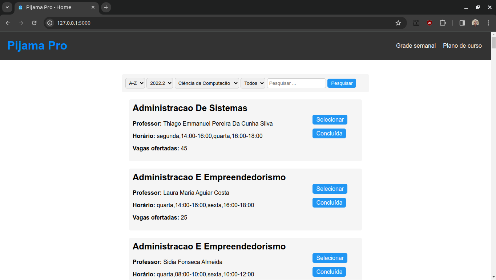

# Pijama Pro

This project is a web application that allows users to better to visualize the classes offered in each course by the Universidade Federal de Campina Grande (UFCG), a Brazilian public university. The application was built using Flask, a web framework written in Python, and HTML, CSS, and JavaScript for the front-end.

**Access here:**  

## Interface



## Features

The application allows users to visualize the classes offered by UFCG in a user-friendly interface.

- Users can filter classes by season (e.g. 2022.1), semester (e.g. 8th), and course name
- The application also provides a search bar that allows users to search for classes by a wanted keyword
- The students can simulate them schedules and set classes as "already done"

## Help improving it

Contributions to this project are welcome. If you find a bug or have an idea for a new feature, please open an issue or submit a pull request.

To run this application on your local machine, you will need to have Python and Pip installed.

After installing Python, you can follow these steps to install the application:

1. Clone this repository to your local machine
2. Open a terminal window and navigate to the project's root directory
3. Create a virtual environment by running the command ```python -m venv venv```
4. Activate the venv by running ```venv\Scripts\activate.ps1``` (Windows) or ```source venv/bin/activate``` (macOS or Linux)
5. Install the required packages by running the command ```pip install -r requirements.txt```
6. Run the command ```python src/app.py```.
7. The application will be accessible in your web browser at [http://localhost:5000/](http://localhost:5000/).
